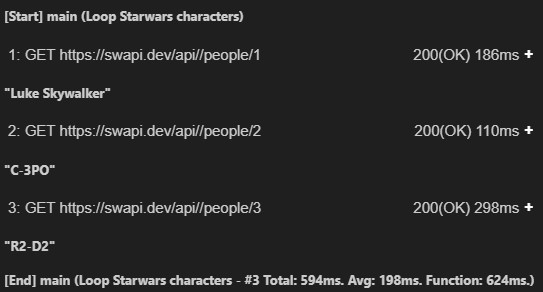

# Functions
Assertive supports a list of built-in functions, but you can also define your own functions which we will refer to as _user-defined_ functions. This page is about the latter. In its most basic form a function combines multiple statements. Because a function has a name, it can be called by this name so the interpreter executes all statements inside the function. Functions can also compute values and return them, so the caller can use its result for subsequent computations.

## Syntax
```assertive
def ID "description string"? (parameter(, parameter)*)? { [statement]* }
```

## Basic function without parameters
Functions that don't need any parameters can be defined and invoked as illustrated here:
```assertive
//function definition that performs two requests
def myFunction
{
  GET "https://www.testuri/id/1";
  GET "https://www.testuri/id/2";
}

//invoke the function like this:
myFunction;

//or like this since the list of parameters is empty:
myFunction();
```

## Function with parameters
```assertive
//function definition that uses the $id parameter
def myFunction($id)
{
  GET "https://www.testuri/id/{{ $id }}";
}

//invoke the function like this:
myFunction(1);
```

## Annotated functions
When the description of the function definition has been set, the function is called an _annotated function_. Assertive will collect metadata about the requests when an annotated function is invoked. This applies to all direct and indirect requests that are made as a result of a function invocation. As soon as the function completes, information like the total number of requests, the total time it took for all requests to complete and the average time per request will be automatically written to the configured output writers.
```assertive
$host = "https://swapi.dev/api/";
def main "Loop Starwars characters"
{
    loop $personId from 1 to 3
    {
        $person = GET "{{ $host }}/people/{{ $personId }}";
        out JsonPath($person, "$.name");
    }
}
main;
```
The code above generates output similar to the following with the [VSCode extension](): 

## Nested functions
Function definitions can be nested. Child functions can invoke their siblings and parent functions. 
It is not possible to invoke a child function declared inside a parent function. This is useful when writing reusable scripts that require some level of encapsulation.
```assertive
def parent
{
  //from here it is possible to invoke the functions in the current scope (such as childA) or a parent function
  childA;

  def childA{
    //the child functions can call each other (such as childB) or a parent function
    childB;
  }

  def childB{
  }
}

//from here it's possible to invoke the parent, but you can NOT call childA or childB
parent;
```

## Returning values
The return keyword allows to return the value of the expression that follows it.
```assertive
//calculate the sum of two numbers
def sum($x, $y){
  return $x + $y;
}

//prints "8"
out sum(3, 5);
```

## Recursion
Functions can also call themselves. Here is an example of a recursive function.
```assertive
def fibonacci($n)
{
    if ($n < 2){
      return $n;
    }
    return fibonacci($n - 1) + fibonacci($n - 2);
}

//print fibonacci sequence:
loop $i from 0 to 10
{
    out fibonacci($i);
}
```