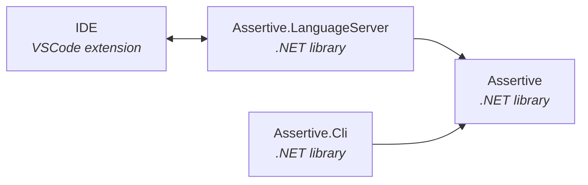

# Technology
Assertive Script consists of several components. This page provides some insights in the different software components that are involved when running Assertive Script.

## High level architecture
The following diagram shows how the different components relate to eachother.

| Component        | Description          | 
|:-------------|:------------------|
| Assertive           | This is the core .NET assembly that contains the lexer, parser and interpreter. The parser and interpreter grammars are written in [ANTLR](https://www.antlr.org/). From these grammars, ANTLR is able to generate a C# visitor class. The interpreter and code analyser use subclasses of the visitor, in order to _visit_ all statements and expressions. The Assertive library is written in pure C# and runs on .NET. | 
| Assertive.Cli           | The command line interface (CLI) to invoke the Assertive interpreter directly from a terminal. It has a direct dependency on the Assertive core library.  | 
| Assertive.LanguageServer | A language server protocol ([LSP](https://microsoft.github.io/language-server-protocol/)) implementation based on [OmniSharp](https://github.com/OmniSharp/csharp-language-server-protocol). This assembly has a direct depency on the Assertive core library. The component can be invoked by any language server client that knows the LSP protocol.|
| IDE           | A language server client that runs on Node.js that invokes the Assertive.LanguageServer component. The Visual Studio Code extension code is written in TypeScript.   | 

