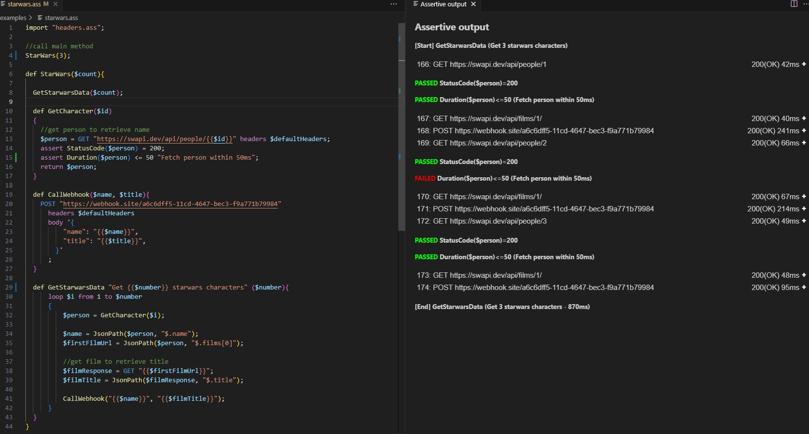

# Assertive Script
Welcome to the home of the documentation for the Assertive Script: a domain specific language (DSL) that targets HTTP request testing. Assertive Script allows you to create test cases by *asserting* properties of a response.

## Code says > 1000 words

## Why yet another language?
While there are several great tools available for HTTP request testing, they seem to be rather limited when it comes to integration into the software development lifecycle. To overcome this gap, Assertive Script is built with the following principles in mind:

### Automate everything
Having a test definition is one thing, but running it manually is not considered to be a DevOps best practice. Assertive scripts can run anywhere you like without modification: on your local machine, in the cloud or on a build server as part of your CI/CD pipeline. 

### Versioning and collaboration
Versioning of any software artifact should happen where it belongs: in a version control system (VCS) such as Git. There is a 1-to-1 relationship between test cases and the code you are testing so it makes sense to keep them in sync. Having your tests inside a VCS makes sure you can easily distribute your tests to other engineers.

### Ease of use
Tests should be available in your IDE, so you can execute them whenever you need them.

----

[^1]: [It can take up to 10 minutes for changes to your site to publish after you push the changes to GitHub](https://docs.github.com/en/pages/setting-up-a-github-pages-site-with-jekyll/creating-a-github-pages-site-with-jekyll#creating-your-site).

[Just the Docs]: https://just-the-docs.github.io/just-the-docs/
[GitHub Pages]: https://docs.github.com/en/pages
[README]: https://github.com/just-the-docs/just-the-docs-template/blob/main/README.md
[Jekyll]: https://jekyllrb.com
[GitHub Pages / Actions workflow]: https://github.blog/changelog/2022-07-27-github-pages-custom-github-actions-workflows-beta/
[use this template]: https://github.com/just-the-docs/just-the-docs-template/generate
